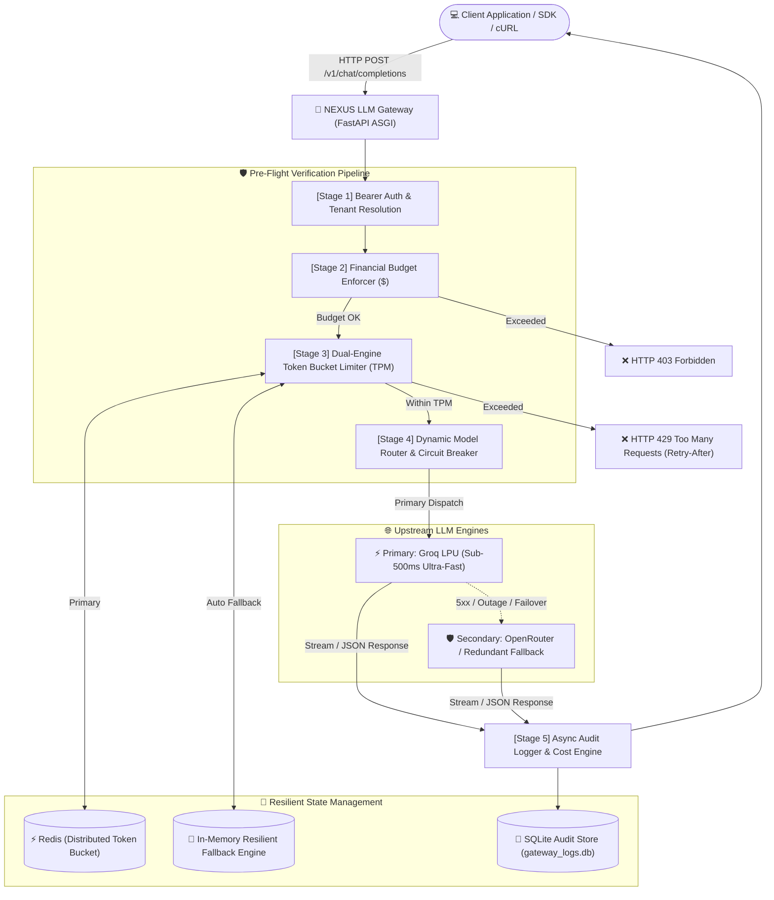

# 🌐 NEXUS LLM Gateway & Control Plane

<p align="center">
  
  
  
  
  
  
  
  
</p>

---

## 📖 Table of Contents
- [Executive Overview](#-executive-overview)
- [System Architecture](#-system-architecture)
- [Core Features](#-core-features)
- [Interactive Control Plane](#-interactive-control-plane)
- [Directory Structure](#-directory-structure)
- [Cloud Deployment (Render & Docker)](#-cloud-deployment-render--docker)
- [Quick Start Guide](#-quick-start-guide)
- [Environment Configuration](#-environment-configuration)
- [API Reference](#-api-reference)
- [Client Integration Examples](#-client-integration-examples)
- [Resilience & Failover Demonstrations](#-resilience--failover-demonstrations)
- [Multi-Tenant Policy Management](#-multi-tenant-policy-management)
- [Production Hardening & Roadmap](#-production-hardening--roadmap)
- [Contributing & License](#-contributing--license)

---

## ⚡ Executive Overview

**NEXUS LLM Gateway** is an enterprise-grade reverse proxy and intelligent control plane engineered for organizations deploying Large Language Models at scale. 

Directly connecting microservices and user applications to third-party model providers introduces critical enterprise vulnerabilities:
- **Catastrophic Outages**: If an upstream model vendor (OpenAI, Anthropic, Groq) throttles or goes down, dependent services crash.
- **Runaway Infrastructure Bills**: Lack of centralized, multi-tenant budget hard-stops leads to bill shocks.
- **No Per-Team Rate Limiting**: Rogue clients or unbounded loops can exhaust company-wide API quotas within seconds.
- **Fragmented Observability**: Scattered client logs make latency tracking, audit compliance, and spend attribution nearly impossible.

**NEXUS resolves all of these challenges** by sitting in front of your upstream LLM providers as a single, highly available gateway with sub-millisecond middleware overhead. It acts as an **exact drop-in replacement for the OpenAI API** while providing resilient rate limiting, automatic self-healing failover, financial guardrails, and real-time observability.

---

## 🏛️ System Architecture

The following diagram illustrates how incoming inference traffic passes through the five sequential micro-stages of the NEXUS pipeline before routing to hardware-accelerated inference engines:



---

## 🌟 Core Features

### 1. OpenAI API v1 Drop-in Replacement
Zero client refactoring required. Point the official `openai` Python/Node.js client or any LangChain/LlamaIndex pipeline to the gateway base URL:
```python
from openai import OpenAI

client = OpenAI(
    base_url="http://localhost:8000/v1",
    api_key="team-alpha-key"
)
```

### 2. Dual-Engine Resilient Rate Limiting
- **Token Bucket Algorithm**: Tracks rolling minute consumption via Tokens Per Minute (TPM).
- **Distributed Redis Tier**: Handles high-concurrency production deployments across load-balanced gateway nodes.
- **Zero-Downtime Memory Fallback**: If Redis disconnects or crashes, the gateway seamlessly shifts to an in-memory sliding tracker without dropping a single user request.
- **RFC-Compliant Throttling**: Returns `HTTP 429 Too Many Requests` with dynamic `Retry-After: <seconds>` headers.

### 3. Multi-Tenant Budget & Cost Financial Guardrails
- **Pre-Flight Budget Enforcement**: Inspects team spend *before* making costly upstream requests. If the assigned quota is reached, requests are safely blocked with `HTTP 403 Forbidden`.
- **Dynamic Cost Engine**: Calculates fractional dollar costs in real-time (`$0.00000006/token` default baseline or exact provider billing metadata).

### 4. Self-Healing Failover & Circuit Breaking
- Automatically intercepts upstream `5xx` server errors, network connection drops, timeouts, and quota exhaustion from primary providers (e.g., Groq LPU).
- Seamlessly re-routes inference to secondary fallback models (e.g., OpenRouter or backup clusters) without client disruption.
- Marks response metadata transparently with `(fallback from <original-model>)`.

### 5. High-Performance Token Streaming (SSE)
- Full support for Server-Sent Events (SSE) streaming (`stream: true`).
- Token-by-token pass-through preserving sub-second First Token Latency (TTFT).

### 6. Centralized SQLite Audit Trail & Analytics
- Persistent request logging in `gateway_logs.db`.
- Records: `timestamp`, `team_id`, `model`, `total_tokens`, `cost_usd`, `latency_seconds`, and `status` (`success`, `fallback_success`, `total_failure`).
- Indexed queries for instant filtering and export.

---

## 🖥️ Interactive Control Plane

The gateway serves a futuristic, cybernetic web application accessible at `http://localhost:8000/` featuring:

| Module | Description |
| :--- | :--- |
| **🚀 Live Playground** | Real-time prompt sandbox with model selector, temperature/token sliders, SSE streaming output, live latency stopwatch, and a visual 5-stage pipeline stepper. |
| **🗺️ Routing Topology** | Interactive SVG wiring diagram demonstrating normal green-line packet paths vs. simulated red-alert failover rerouting to secondary providers. |
| **📊 Telemetry & Analytics** | Real-time KPI summary (Total Requests, Success Rate, Average Latency, Total Cost, Active Providers, and Health Status). |
| **📋 Audit Logs & Traces** | Searchable and filterable data grid of all past requests with JSON inspector modals showing complete trace diagnostics. |
| **🛡️ Quotas & Rate Limiter** | Live progress bars depicting multi-tenant TPM limits and budget depletion. Includes a **"Spam Burst"** simulator to trigger and observe live HTTP 429 responses. |
| **💻 API & cURL Studio** | Pre-configured, copy-pasteable integration snippets for cURL, Python OpenAI SDK, and Node.js. |

---

## 📂 Directory Structure

```text
llm-gateway/
├── app/
│   ├── api/
│   │   └── routes.py              # API routes (/v1/chat/completions, /api/* control plane)
│   ├── core/                      # Core gateway logic & application settings
│   ├── middleware/
│   │   └── rate_limit.py          # Dual-engine Token Bucket & Budget middleware
│   ├── models/
│   │   └── schemas.py             # Pydantic v2 validation models (OpenAI compatible)
│   ├── services/
│   │   ├── logger.py              # SQLite audit persistence & analytics aggregation
│   │   └── providers/
│   │       ├── base.py            # Abstract Base Class for LLM providers
│   │       ├── groq.py            # Groq LPU high-speed inference integration
│   │       └── openrouter.py      # OpenRouter fallback integration
│   ├── static/                    # Frontend Single Page Application (SPA)
│   │   ├── app.js                 # Control plane reactive logic & charts
│   │   ├── index.html             # Cybernetic glassmorphic user interface
│   │   └── style.css              # Custom design system & animations
│   ├── main.py                    # FastAPI application initialization & route mounting
│   └── view.py                    # Static frontend template router
├── config/
│   └── gateway_policies.yml       # Declarative policy definitions
├── tests/                         # Automated test suite
├── DEPLOYMENT_GUIDE.md            # Complete online cloud deployment walkthrough
├── render.yaml                    # Render Blueprint Infrastructure-as-Code
├── Dockerfile                     # Multi-stage production container
├── Procfile                       # ASGI Web process definition
├── gateway_logs.db                # SQLite audit trace database
├── start_demo.sh                  # 1-click startup automation script
└── README.md                      # Project documentation
```

---

## 🌐 Cloud Deployment (Render & Docker)

NEXUS LLM Gateway is pre-configured for **zero-friction online deployment** to [Render](https://render.com), [Railway](https://railway.app), or any container platform.

### Deploy to Render in 3 Minutes:
1. Push your repository to GitHub (`shivang969/llm-gateway`).
2. Go to [dashboard.render.com](https://dashboard.render.com) -> **New +** -> **Blueprint**.
3. Select your repository. Render automatically reads [`render.yaml`](./render.yaml).
4. Enter your `GROQ_API_KEY` (and optional `OPENROUTER_API_KEY` / `REDIS_URL`) and click **Apply**.
5. Your gateway and cybernetic dashboard will be live with free automatic SSL (`https://<service-name>.onrender.com`).

👉 **Read the full [Deployment Guide (DEPLOYMENT_GUIDE.md)](./DEPLOYMENT_GUIDE.md)** for step-by-step instructions, Docker instructions, and production verification commands.

---

## 🚀 Quick Start Guide

### Option 1: Automated 1-Click Launch (Recommended)
The included shell script inspects your environment, resolves dependencies, frees port `8000`, launches the Uvicorn ASGI server with hot-reload, and automatically opens your browser:

```bash
chmod +x ./start_demo.sh
./start_demo.sh
```

### Option 2: Manual Installation & Execution

1. **Clone the repository**:
   ```bash
   git clone https://github.com/your-username/llm-gateway.git
   cd llm-gateway
   ```

2. **Create and activate a virtual environment**:
   ```bash
   python3 -m venv venv
   source venv/bin/activate    # On Windows: venv\Scripts\activate
   ```

3. **Install dependencies**:
   ```bash
   pip install fastapi uvicorn httpx pydantic python-dotenv redis
   ```

4. **Launch the Gateway**:
   ```bash
   uvicorn app.main:app --host 0.0.0.0 --port 8000 --reload
   ```

5. **Open the Control Plane**:
   Navigate to [http://localhost:8000](http://localhost:8000) in your browser.

---

## ⚙️ Environment Configuration

Create a `.env` file in the project root:

```env
# Primary High-Speed Provider (Groq LPU)
GROQ_API_KEY=gsk_your_groq_api_key_here

# Secondary Fallback Provider (OpenRouter)
OPENROUTER_API_KEY=sk-or-v1-your_openrouter_api_key_here

# Rate Limiter Distributed Cache (Optional - falls back to in-memory if offline)
REDIS_URL=redis://localhost:6379

# Server Configuration
PORT=8000
HOST=0.0.0.0
```

> **Note**: If `REDIS_URL` is omitted or Redis is unreachable, the gateway will log a warning and seamlessly run on its built-in in-memory dual-engine fallback.

---

## 📡 API Reference

### 1. OpenAI Chat Completions Proxy
`POST /v1/chat/completions`

Sends an inference request through the gateway pipeline.

#### Request Headers:
- `Authorization: Bearer <TEAM_API_KEY>` (e.g. `team-alpha-key` or `team-beta-key`)
- `Content-Type: application/json`

#### Request Body (JSON):
```json
{
  "model": "qwen/qwen3.8-27b",
  "messages": [
    {"role": "system", "content": "You are a helpful coding assistant."},
    {"role": "user", "content": "Write a Python function to compute Fibonacci numbers."}
  ],
  "temperature": 0.7,
  "max_tokens": 256,
  "stream": false
}
```

#### Response (JSON):
```json
{
  "id": "chatcmpl-871ab479",
  "object": "chat.completion",
  "model": "qwen/qwen3.8-27b",
  "choices": [
    {
      "index": 0,
      "message": {
        "role": "assistant",
        "content": "def fibonacci(n):\n    a, b = 0, 1\n    for _ in range(n):\n        yield a\n        a, b = b, a + b"
      },
      "finish_reason": "stop"
    }
  ],
  "usage": {
    "prompt_tokens": 25,
    "completion_tokens": 42,
    "total_tokens": 67,
    "cost": 0.000004
  }
}
```

---

### 2. Internal Control Plane APIs

| Method | Endpoint | Description |
| :--- | :--- | :--- |
| `GET` | `/health` | Liveness and health probe for load balancers. |
| `GET` | `/api/stats` | Aggregated system metrics (request counts, avg latency, spend, provider status). |
| `GET` | `/api/logs` | Query audit trail from `gateway_logs.db` with query parameters (`limit`, `team_id`, `status`, `search`). |
| `GET` | `/api/teams` | Active multi-tenant policies, current rolling TPM, and budget utilization. |
| `GET` | `/api/models` | List of supported primary models and active fallback routing topology. |
| `POST` | `/api/reset-demo` | Seeds realistic presentation data for instant interview/portfolio demonstrations. |
| `POST` | `/api/clear-logs` | Resets all logs and in-memory rate-limiting counters. |

---

## 💻 Client Integration Examples

### Python (Official `openai` SDK)
```python
from openai import OpenAI

# Simply redirect base_url to the NEXUS Gateway
client = OpenAI(
    base_url="http://localhost:8000/v1",
    api_key="team-alpha-key"
)

# Standard non-streaming completion
response = client.chat.completions.create(
    model="qwen/qwen3.8-27b",
    messages=[{"role": "user", "content": "Explain vector databases in one sentence."}],
    max_tokens=60
)
print("Response:", response.choices[0].message.content)

# Live streaming completion
stream = client.chat.completions.create(
    model="qwen/qwen3.8-27b",
    messages=[{"role": "user", "content": "Count from 1 to 5."}],
    stream=True
)
for chunk in stream:
    if chunk.choices[0].delta.content:
        print(chunk.choices[0].delta.content, end="", flush=True)
print()
```

### Node.js / TypeScript
```typescript
import OpenAI from "openai";

const openai = new OpenAI({
  baseURL: "http://localhost:8000/v1",
  apiKey: "team-beta-key"
});

async function main() {
  const completion = await openai.chat.completions.create({
    model: "qwen/qwen3.8-27b",
    messages: [{ role: "user", content: "What is an LLM gateway?" }],
  });
  console.log(completion.choices[0].message.content);
}

main();
```

### cURL
```bash
curl -X POST http://localhost:8000/v1/chat/completions \
  -H "Authorization: Bearer team-alpha-key" \
  -H "Content-Type: application/json" \
  -d '{
    "model": "qwen/qwen3.8-27b",
    "messages": [{"role": "user", "content": "Hello from terminal!"}],
    "max_tokens": 50
  }'
```

---

## 🛡️ Resilience & Failover Demonstrations

NEXUS includes built-in simulation triggers designed to demonstrate failover and rate limiting live in technical interviews or presentations:

### 1. Simulated Provider Outage & Auto-Recovery
- Set model parameter to `"fail-test-model"` in your request.
- The gateway simulates an upstream `HTTP 503 Provider Outage` on the primary provider.
- The dynamic router catches the exception, engages the circuit breaker, and automatically reroutes to the configured fallback model (`qwen/qwen3.8-27b` via secondary routes).
- Returns a successful response marked with `fallback_success` status.

### 2. Burst Rate Limiting (HTTP 429)
- Send requests using the strict `team-alpha-key` (150 TPM quota).
- Once the cumulative tokens within the rolling 60-second window exceed 150, the gateway rejects subsequent calls immediately with:
  ```json
  {
    "detail": "Rate limit exceeded for team 'team-alpha'. Current usage: 200/150 TPM."
  }
  ```
  Along with the `Retry-After: <seconds>` HTTP header.

### 3. Financial Quota Protection (HTTP 403)
- If a tenant's cumulative spend exceeds their allocated budget ceiling (e.g., $1.00 for Alpha Tier), the gateway rejects requests with `HTTP 403 Forbidden` prior to dispatching to upstream providers, preventing financial loss.

---

## 👥 Multi-Tenant Policy Management

Tenants are configured with granular rate limits and financial caps in `app/api/routes.py`:

```python
TEAMS_CONFIG = {
    "team-alpha-key": {
        "id": "team-alpha", 
        "name": "Alpha Tier (Strict Quotas)", 
        "tpm": 150,         # 150 Tokens per minute limit
        "budget": 1.00       # $1.00 spending cap
    }, 
    "team-beta-key": {
        "id": "team-beta",  
        "name": "Beta Tier (Enterprise High-TPM)", 
        "tpm": 50000,       # 50,000 Tokens per minute limit
        "budget": 50.00      # $50.00 spending cap
    }
}
```

Fallback mappings dictate model failover pairs:
```python
FALLBACK_MODEL_MAP = {
    "llama3-8b-8192": "qwen/qwen3.8-27b",
    "fail-test-model": "qwen/qwen3.8-27b",
    "primary-outage-simulation": "qwen/qwen3.8-27b"
}
```

---

## 🔮 Production Hardening & Roadmap

- [ ] **Semantic Caching**: Integrate Redis Vector or ChromaDB to cache identical or semantically similar prompt responses, reducing cost and latency to ~5ms.
- [ ] **Data Loss Prevention & PII Masking**: Implement Presidio / regex pipelines to redact credit card numbers, SSNs, and API keys before forwarding upstream.
- [ ] **Distributed Tracing**: Export OpenTelemetry (OTel) traces to Prometheus, Grafana, and Jaeger.
- [ ] **Dynamic YAML Hot-Reloading**: Watch `config/gateway_policies.yml` to alter rate limits and team budgets without restarting the service.

---

## 📄 License & Attribution

Distributed under the **MIT License**. Free for academic, portfolio, and commercial use.

Developed with ❤️ as a high-performance, fault-tolerant infrastructure component for modern AI applications.
